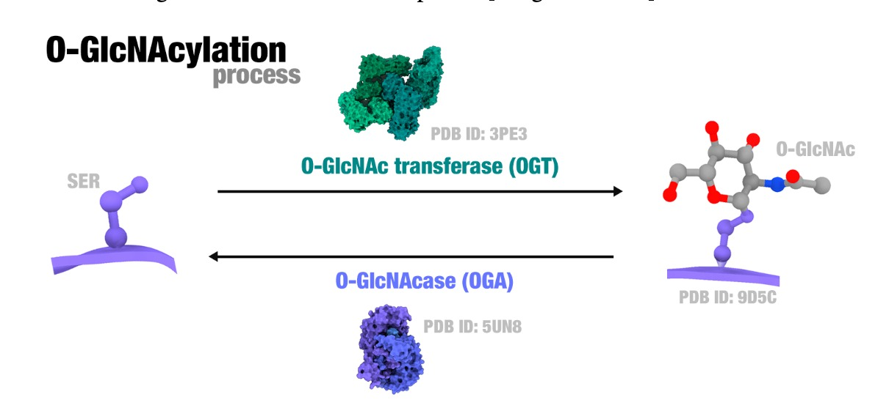
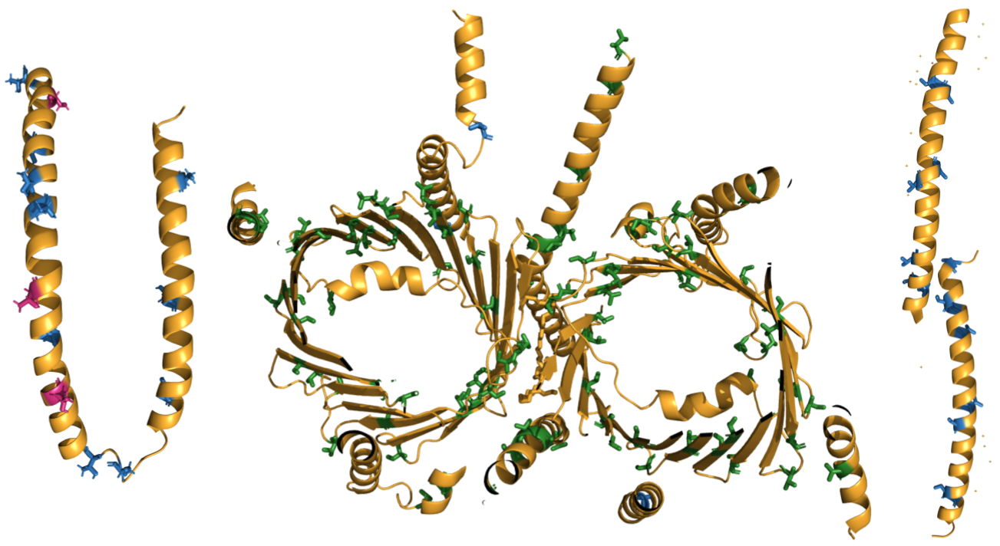

# About
A deep learning model that uses [ESM2](https://github.com/facebookresearch/esm) embeddings for predicting O-GlcNAc sites on a protein sequence.

O-GlcNAcylation is a post-translational modification (PTM) that involves the covalent bonding of an N-acetylglucosamine (GlcNAc) molecule to serine or threonine amino acid residues in proteins. The modification is catalyzed by O-GlcNAc transferase (OGT) and removed by O-GlcNAcase (OGA), thereby serving as a sensitive regulator of cellular status responses.

Left: PDB Structure 1XQ8 of Human Micelle-Bound Alpha-Synuclein. Center: PDB Structure 7CK6 of Human Protein Translocase of Mitochondria. Right: PDB Structure 3CI9 of Human HSBP1. In all protein structures, serine and threonine residues are painted accordingly: experimentally verified sites of O-GlcNAc are pink, predicted by our model are painted blue, and others are painted green.
